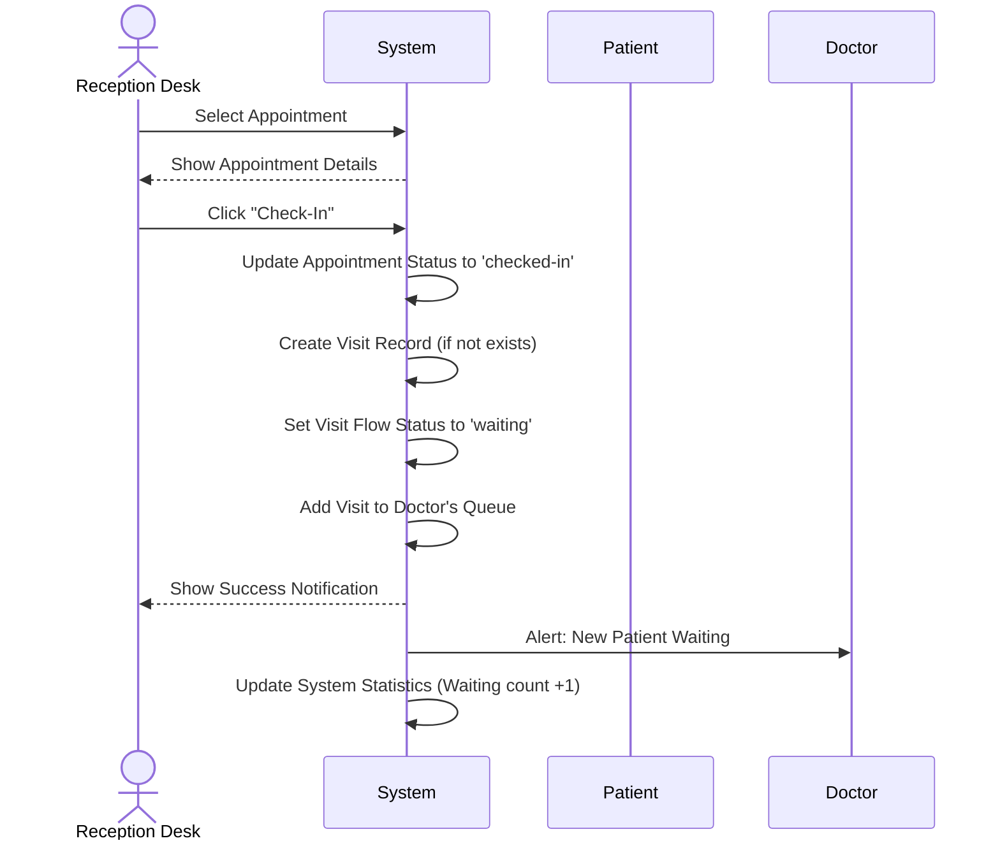

# 🏥 Central Hospital Patient Flow System — System Specification

**Version:** 1.0 | **Date:** 2026-05-01

**System Overview:** Central Hospital, located in Izmir, serves approximately 1,000 patients daily across 5 departments: Cardiology, Neurology, Dermatology, Pediatrics, and Emergency. The hospital faces significant operational challenges due to a fragmented, paper-based patient flow management system. This document specifies an interactive, web-based Patient Flow Management System (PFMS) designed to support four distinct user roles: Hospital Administrator, Reception Desk, Doctor Session, and Nurse Assistant.

---

## 1. Actors and User Roles

| Actor | Identity | Primary Interface | Main Responsibilities |
|-------|----------|-------------------|---------------------|
| Hospital Administrator | [EMAIL_ADDRESS] / 1234 | **Admin Dashboard** (UC-01) | System configuration, department and doctor management, audit reporting. |
| Reception Desk | [EMAIL_ADDRESS] / 1234 | **Reception Dashboard** (UC-02) | Patient check-in, manual appointment creation, queue management. |
| Doctor Session | [EMAIL_ADDRESS] / 1234 | **Doctor Dashboard** (UC-03) | Patient flow monitoring, consultation management, status updates. |
| Nurse Assistant | [EMAIL_ADDRESS] / 1234 | **Nurse Dashboard** (UC-04) | Patient monitoring, triage support, test coordination. |

---

## 2. Use Cases (UC)

### UC-01: Hospital Administrator Dashboard

**Description:** System configuration and oversight.

**Primary Actor:** Hospital Administrator

**Alternative Actors:** Reception, Doctor, Nurse

| Use Case | Description | Flow |
|----------|-------------|------|
| **UC-01.01** | System Configuration | **Actor** manages departments, doctors, and audit logs. |
| **UC-01.02** | User Account Management | **Actor** creates, updates, or disables user accounts. |
| **UC-01.03** | Dashboard Analytics | **Actor** views system-wide statistics and audit reports. |

---

### UC-02: Reception Desk Dashboard

**Description:** Real-time patient flow and queue management from the reception desk.

**Primary Actor:** Reception Desk

**Alternative Actors:** Doctor, Nurse

| Use Case | Description | Flow |
|----------|-------------|------|
| **UC-02.01** | Check-in Appointment | **Actor** checks in patients and moves them to the waiting area. |
| **UC-02.02** | Manual Appointment Booking | **Actor** creates appointments manually. |
| **UC-02.03** | Emergency Priority Management | **Actor** flags patients as emergencies, moving them to the front of the queue. |
| **UC-02.04** | Queue Status Monitoring | **Actor** monitors the patient queue and doctor availability in real-time. |

---

### UC-03: Doctor Session Dashboard

**Description:** Doctor-specific patient management and session control.

**Primary Actor:** Doctor Session

**Alternative Actors:** Nurse, Reception

| Use Case | Description | Flow |
|----------|-------------|------|
| **UC-03.01** | Doctor Session Control | **Actor** manages their session, including starting/completing consultations and changing consultation limits. |
| **UC-03.02** | Patient Flow Management | **Actor** updates patient statuses within their session (waiting → in-consultation → assessment → completed). |
| **UC-03.03** | Patient Details Review | **Actor** reviews comprehensive patient information before consultation. |

---

### UC-04: Nurse Assistant Dashboard

**Description:** Nurse-driven patient monitoring and coordination between departments.

**Primary Actor:** Nurse Assistant

**Alternative Actors:** Doctor, Reception

| Use Case | Description | Flow |
|----------|-------------|------|
| **UC-04.01** | Patient Triage Support | **Actor** performs preliminary patient assessments and assigns urgency levels. |
| **UC-04.02** | Test Request & Tracking | **Actor** requests laboratory and imaging tests and monitors their status. |
| **UC-04.03** | Inter-Departmental Coordination | **Actor** coordinates patient transfers between departments. |
| **UC-04.04** | Nurse Workspace Overview | **Actor** views all active tasks and pending requests requiring nurse intervention. |

---

## 3. Static Model (Classes & Relationships)

```mermaid
classDiagram
    class HospitalAdmin {
        +String adminID
        +String name
        +String email
        +String passwordHash
    }

    class User {
        +String userID
        +String role
        +String name
        +String email
        +String passwordHash
    }

    class Department {
        +String departmentID
        +String name
        +String icon
    }

    class Doctor {
        +String doctorID
        +String userID
        +String departmentID
        +String name
    }

    class Nurse {
        +String nurseID
        +String userID
        +String departmentID
        +String name
    }

    class Patient {
        +String patientID
        +String name
        +String nationalID
        +String phoneNumber
    }

    class Appointment {
        +String appointmentID
        +String patientID
        +String doctorID
        +Date date
        +String timeSlot
        +String status
    }

    class Visit {
        +String visitID
        +String patientID
        +String doctorID
        +Date date
        +String timeSlot
        +String flowStatus
        +String triageLevel
        +String consultationStatus
    }

    class DepartmentSession {
        +String sessionID
        +String doctorID
        +Date date
        +String startTime
        +String endTime
        +int consultationLimit
    }

    class PatientFlow {
        +String flowID
        +String visitID
        +String queueStatus
        +String nurseTaskStatus
        +String labStatus
        +String imagingStatus
    }

    class LabTest {
        +String testID
        +String visitID
        +String testType
        +String status
        +String assignedTo
    }

    class ImagingExam {
        +String examID
        +String visitID
        +String examType
        +String status
        +String assignedTo
    }

    class AuditLog {
        +String logID
        +String userID
        +String action
        +Date timestamp
        +String details
    }

    User <|-- HospitalAdmin
    User <|-- Doctor
    User <|-- Nurse
    Department ||-- Doctor
    Department ||-- Nurse
    Department ||-- Visit
    Doctor ||-- DepartmentSession
    Doctor ||-- Visit
    Patient ||-- Appointment
    Patient ||-- Visit
    Appointment ||-- Visit
    Visit ||-- PatientFlow
    Visit ||-- LabTest
    Visit ||-- ImagingExam
    AuditLog ||-- User
```

---

## 4. Interaction Diagrams (Flows)

### UC-02.01: Check-in Appointment



---

### UC-03.02: Doctor Updates Patient Status

```mermaid
sequenceDiagram
    actor DOCTOR as Doctor
    